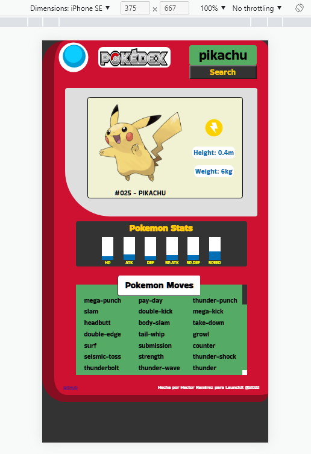

# Kata Semana 4 - Pokedex con JS 
- Maquetación del sitio con HTML
- Diseño con CSS para que parezca un pokedex la página
- Tener un input de entrada, donde se meta el nombre del pokemón a buscar.
- Tomar ese input e ir a consultar el API de [pokeapi](https://pokeapi.co/)
- mostrar en pantalla los siguientes datos del pokemón ingresado:
    - Nombre
    - Imágen
    - Tipo de pokemón
    - Estadísticas
    - Movimientos

Bonus:
- Bonus si tu página es responsive y se puede ver en celulares
- Bonus de despliegue de tu pokedex
- Bonus de uso de otras rutas como búsqueda por número de pokemón o mostrar un rango de pokemóns

## Link
https://hectorramirezn.github.io/FrontEnd-Mision/Semana4-JS-Pokedex/

## Captura 

## Responsive

